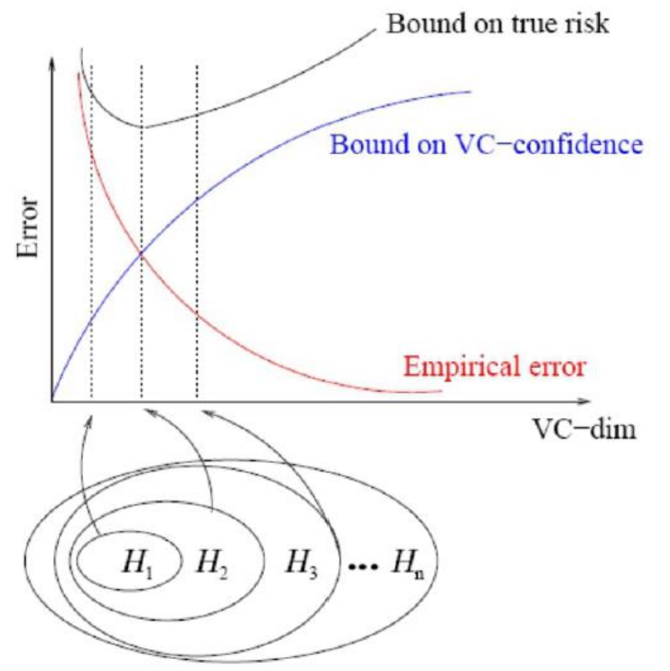

#Lezione 5

##Esempi di spazi delle ipotesi

Seguono alcuni esempi di spazi per le ipotesi nei problemi di apprendimento supervisionato, cioè quei problemi in cui si vuole stabilire se un elemento *x* appartiene o meno ad una classe.

###Iperpiani in R2

**Iperpiano**: dato uno spazio a *n*-dimensioni, un iperpiano per quello spazio è un sottospazio di dimensione *n-1*. Quindi gli iperpiani in R2 sono tutte le rette del piano.

Lavorando in R2 lo spazio delle istanze è definito come:

> X = {x | x ϵ R2}.

Mentre lo spazio delle ipotesi è dato dalle dicotomie indotte da iperpiani in R2, cioè da tutte le possibili divisioni del piano.

> H = {f(w,b)(x) | f(w,b)(x) = sign(w * x + b), w ϵ R2, b ϵ R}

Così facendo vengono prese in considerazione tutte le rette che dividono R2 in due parti in modo che da una parte l'ipotesi valga 1 e dall'altra -1.

###Dischi in R2

Sempre in R2 è possibile considerare come spazio delle ipotesi tutte le dicotomie indotte da disci in R2 e centrati nell'origine.

> H = {fb(x) | fb(x) = sign(||x||2 - b), w ϵ R2, b ϵ R}

Il che vuol dire che all'interno del disco le ipotesi valgono -1 mentre al di fuori valgono 1.

###Congiunzione di *m* letterali positivi

Lo spazio delle istanze questa volta è dato da tutte le stringhe di *m* bits 

> X = {s | s ϵ {0,1}m}

Lo spazio delle ipotesi è dato da tutte le sentenze logiche che riguardano i letterali positivi l1,l2,...,lm (li è vero se l'*i*-esimo bit è 1) e che contengono solo l'operatore ⋀.

> H = { f{i1,...,ij}(s) | f{i1,...,ij} (s) equivale a li1 ⋀ li2 ⋀ ... ⋀ ij, {i1...ij} sottoinsieme di {1..m}}

##Misurare la complessità dello spazio delle ipotesi

Considerato un determinato spazio delle ipotesi *H*, questo contiene sempre:

- L'**ipotesi più specifica**: ipotesi più stretta, consistente con i dati, nell'esempio del disco è il disco più stretto in grado di contenere tutti i punti negativi.
- L'**ipotesi più generale**: quella più grande, consistente con i dati, sempre nell'esempio del disco, è quello del disco più grande possibile e che non contiene punti positivi.

**shattering**: (frammentazione), dato *S* sottoinsieme dello spazio delle istanze, si dice che *S* è frammentato dallo spazio delle ipotesi *H* se:

> ∀ S' ⊆ S, ∃ h ϵ H, tale che ∀x in S, h(x) = 1 se e solo se x appartiene a S'.

Cioè *H* realizza tutte le possibili dicotomie di *S*.

*H* frammenta un certo insieme *S* se è possibile trovare un iperpiano che raccoglie tutti i punti dell'insieme *S*. Ovvero per tutte le dicotomie di *S* esiste un iperpiano che riesce a realizzarle.

###VC (Vapnik-Chervonenkis) Dimension

La VC-Dimension è la dimensione di uno spazio delle ipotesi *H* definito su uno spazio delle istanze *X* ed è data dalla cardinalità del sottoinsieme più grande frammentato da *H*.

> VC(H) = max(S ⊆ X)|S| tale che H frammenta S
> 
> VC(H) = ∞ se S non è limitato

Ad esempio nello spazio delle ipotesi dato dagli iperpiani su R2.

Se nello spazio delle istanze ho 2 punti, questo viene frammentato da *H*, perché posso sempre trovare una retta che riesce a realizzare tutte le possibili dicotomie di due punti su un piano.

Se nello spazio delle istanze ho 3 punti, riesco comunque a realizzare tutte le dicotomie.

Se nello spazio delle istanze ho 4 punti qualsiasi non si riesce a trovare un iperpiano che realizza la dicotonomia, quindi *VC(H) = 3*.

Segue che, prendendo uno spazio delle ipotesi di cardinalità finita si ha che:

> VC(H) ≤ log2(|H|)

Questo perché per ogni *S* frammentato da *H*, abbiamo *|H| >= 2|S|*, cioè per ogni dicotomia in *S* esite un ipotesi in *H* che la realizza, ovvero devono essere disponibili in *H* tante ipotesi quanti sono le dicotomie in *H*.

Scegliendo un *S* tale che *|S| = VC(H)*, si ottiene *|H| >= 2VC(H)*, prendendo il logaritmo si trova quello che si stava cercando, ovvero *VC(H) <= log2(|H|)*.

**Dal libro**:

Se un dataset contiene *N* elementi, questi *N* elementi possono essere etichettati con degli 0 e 1 in *2N* modi diversi.

Se per ognuno di questi modi è possibile trovare un ipotesi *h ϵ H* che separa tutte le istanze negative da quelle positive allora si dice che *H* frammenta il dataset *N*. Il che vuol dire che il dataset *N* può essere appreso con un errore empirico nullo.

Il massimo numero di punti che possono essere frammentati da *H* è detto *VC(H)* e fornisce una misura della capacità di *H*.

##Bound sull'errore di generalizzazione

Considerando un problema di apprendimento binario, con: 

> Training set S={(xi,yi)}i=1...N
>
>Spazio delle ipotesi H={h𝜃(x)}

Supponendo di avere un algoritmo di apprendimento *L* che restituisce l'ipotesi _h𝜃\*(x)_ che minimizza l'errore empirico su *S* espresso come *erroreS(h𝜃(x))*.

È possibile derivare un bound (limite superiore) per l'errore ideale o errore di generalizzazione, valido con probabilità *(1 - δ)* con *δ* piccolo a piacere:

> erroreD(h𝜃(x)) ≤ erroreS(h𝜃(x)) + g(N, VC(H), δ)

Il primo termine *erroreS(h𝜃(x))* dipende dall'ipotesi restituita dall'algoritmo di apprendimento L.

Il secondo termine *g(N, VC(H), δ)* non dipende da *L*, ma dal numero di esempi di training utilizzati (inversamente proporzionale), dalla *VC-dimension* (direttamente proporzionale) e dalla confidenza, ovvero dal termine *δ*.

Il termine *g(N, VC(H), δ)* viene anche chiamato **VC-confidence** e risulta essere monotono rispetto al rapporto *VC(H)/N*.

##Structural Risk Minimization (SRM)

Approccio per la scelta dello spazio delle ipotesi proposto da Vapnik che cerca di trovare un compromesso tra l'errore empirico e la VC-Confidence.

Si considerano spazi delle ipotesi sempre più piccoli H1 ⊆ H2 ⊆ ... ⊆ Hn tali che VC(H1) ≤ VC(H2) ≤ ... ≤ VC(Hn)

Si seleziona lo spazio delle ipostesi Hi che ha il valore del bound sull'errore di generalizzazione più piccolo.

