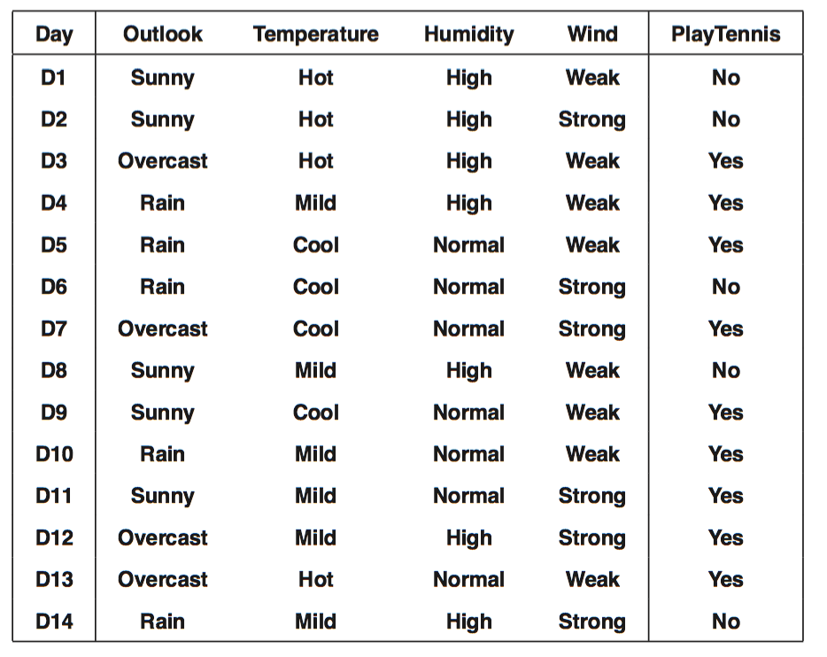
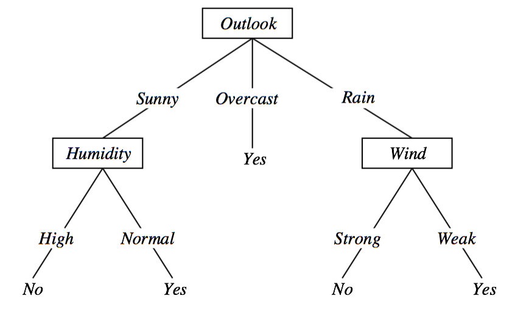

#Lezione 7 - Alberi di decisione

In molte situazioni del mondo reale non è sufficiente apprendere funzioni booleane con ingressi binari (quello che si fa con il concept learning).

Gli alberi di decisione funzionano bene con:

- Istanze rappresentate da coppie attributo-valore
- Funzioni target con valori di output discreti (più di due valori), come il riconoscimento della categoria di una pagina web
- Concetti descritti da disgiunzioni di funzioni booleane
- Esempi di apprendimento che possono contenere errori e/o valori mancanti (es: diagnosi medica senza alcuni esami).

Gli algoritmi che lavorano su alberi di decisione sono molto efficenti ed è per questo che vengono utilizzati in applicazioni pratiche.

## È il giorno giusto per giocare a tennis?

Dati:



Albero:



Come si può notare, nell'albero ogni nodo corrisponde ad un attributo e l'arco tra un nodo e l'altro corrisponde uno dei possibili valori, mentre le foglie dell'albero forniscono una classificazione.

Per classificare un'istanza si parte dalla radice e si scende verso le foglie, secondo quanto specificato dai test sugli attributi definiti dai nodi dell'albero.

Se si raggiunge una foglia l'etichetta ad essa associata rappresenta la classificazione.

Dato un albero di decisione, questo corrisponde ad una **disgiunzione di congiunzioni**.

Lo stesso albero può essere infatti rappresentato come:

```
(Outlook = Sunny and Humidity = Normal) 
            or 
    (Outlook = Overcast)
            or
(Outlook = Rain and Wind = Weak) 
```

##ID3 - Apprendimento su un albero

L'algoritmo di apprendimento che costruisce l'albero di decisione trammite una procedura top down in stile divide et impera.

Questo algoritmo apprende l'albero di dicesione costruendolo con un approccio top-down. La costruzione inizia con la domanda "Quale attributo dovrebbe essere testato alla radice dell'albero?". Per scegliere l'attributo vengono valutati tutti i possibili candidati utilizzando un test statistico per valutare quando bene il singolo attributo classifica il training set.

Viene selezionato il miglior attributo e utilizzato come test alla radice dell'albero. Vengono poi creati tanti figli quanti sono i possibili valori dell'attributo e gli esempi del training set vengono partizionati tra i vari figli, in modo che il loro valore per quell'attributo corrisponda con il valore del nodo.

Questo processo vienei ripetuto per ognuno dei nodi creati fino a che non vengono esaminati tutti gli esempi.

Più formalmente, dato un training set *Tr* e un insieme di attributi *A*, algoritmo è definito come:

1. Crea il nodo radice e copia in *T* gli esempi di *Tr* e inserisce tutti gli attributi in *A*.
2. Se gli esempi in *T* sono tutti delle stessa classe, ritorna l'albero con un solo nodo e etichetta uguale alla classe.
3. Se *A* è vuoto, ritorna l'lalbero con un solo nodo e come etichetta la classe di maggioranza in *T*.
4. Altrimenti, si sceglie l'attributo *a* tra gli attributi presenti in *A* (il migliore) e si partiziona *T* secondo i possibili valori che l'attributo *a* può assumere: *T<sub>a = val<sub>1</sub></sub>, ... ,  T<sub>a = val<sub>n</sub></sub>*
    1. Per ogni *T<sub>a = val<sub>i</sub></sub>*, se è vuoto crea una foglia con l'etichetta della classe più frequente, altrimenti crea un sottoalbero con l'algoritmo ID3 con *T<sub>a = val<sub>i</sub></sub>* e *A - {*a*}*.
5. Ritorna *T*.

Quando una partizione risulta vuota, vuol dire che non esistono esempi nel training set per i quali il valore dell'attributo selezionato è uguale a quel dato valore.

###Esempio sui dati del tennis

```
T = {D1, ..., D14}
A = {Outlook, Temperature, Humidity, Wind}

a = Outlook

                   (Outlook)
               /       |       \
            sunny    overcast   rain
            /          |          \
(T_Overlook = Sunny
A = Temp, Hum, Wind})
```

Al secondo passo mi ritrovo scelgo `a = Humidity`, ottenendo:

```
                   (Outlook)
               /       |       \
            sunny    overcast   rain
            /          |          \
       (Humidity)
       /        \
    High        Normal
    /               \
   No               Si
```

In questo caso i figli vengono marcati con un valore quando si è nel caso in cui tutti gli esempi della partizione hanno lo stesso valore target.

Si prosegue finché l'albero non è completo

###Alla ricerca dell'attributo ottimo

Nell'esempio precedente è stato scelto un attributo a caso, ma nel caso pratico questo non conviene.

Come viene scelto l'ottimo dipende da algoritmo ad algoritmo, nel caso di ID3 vengono utilizzati i concetti di *entropia* e *guadagno entropico*.

> E(S) = -p<sub>-</sub>log<sub>2</sub>(p<sub>-</sub>) -p<sub>+</sub>log<sub>2</sub>(p<sub>+</sub>)

Dove p<sub>-</sub> e p<sub>+</sub> rappresentano la proporzione degli esempi della di una classe e dell'altra (si assume che ci siano solo due classi) all'interno dell'insieme S.

L'entropia misura il grado di purezza degll'insieme degli esempi.

Nel caso ci siano più valori l'entropia si calcola come

> \- Sommatoria<sub>v</sub> (p<sub>v</sub>log<sub>2</sub>(p<sub>v</sub>))

ID3 sceglie come attributo *a*, quello che massimizza il guadagno entropico.

> G(S,*a*) = E(S) - Sommatoria<sub>v ϵ V(a)</sub> (E(S<sub>a = v</sub>) |S<sub>a=v</sub>| / |S|)

Il guadagno misura la riduzione aspettata dell'entropia nel partizionare i dati utilizzando *a*.

L'entropia attesa è descritta dal secondo termine ed è semplicemente la sommatoria delle entropie di tutti i sottoinsiemi di *S*, pesata secondo il numero di esempi che appartengono al sottoinsieme di *S*.

**Problema**: L'utilizzo del guadagno entropico favorisce troppo gli attributi che possono assumere tanti valori diversi, ad esempio l'attributo *Data*.
Seguendo l'esempio della data, segliere quell'attributo porta ad ottenere tante partizioni, ognuna di pochi elementi e che non forniscono informazioni utili.

> GainRatio(S, a) = G(S, a) / SI(S,a)

Dove *SI* rappresenta la *split information*, un valore che misura quanti e quanto uniformi sono i sottoinsiemi generati dall'attributo *a* a partire dall'insieme *S*.

> SI(S,a) = - Sommatoria<sub>v ϵ V(a)</sub>( log<sub>2</sub>(|S<sub>a = v</sub>| / |S|) |S<sub>a = v</sub>| / |S| )

E corrispone all'entropia di *S* dati i possibili valori di *a*.

*GainRatio* non risolve tutti i problemi, infatti può succedere che attributi significativi e che possono assumere tanti valori, vengano svantaggiati rispetto al altri.

Un'altra idea può essere quella di calcolare il *Guadagno* per ogni attributo e fare la media dei valori trovati, per poi andare a scegliere, tra gli attributi con *Guadagno* sopra la media, l'attributo che ha *GainRatio* maggiore.

