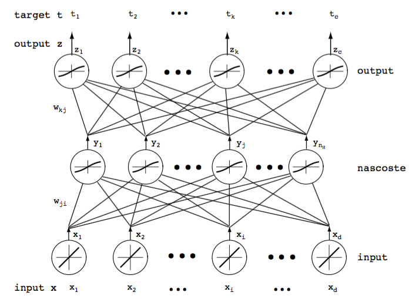
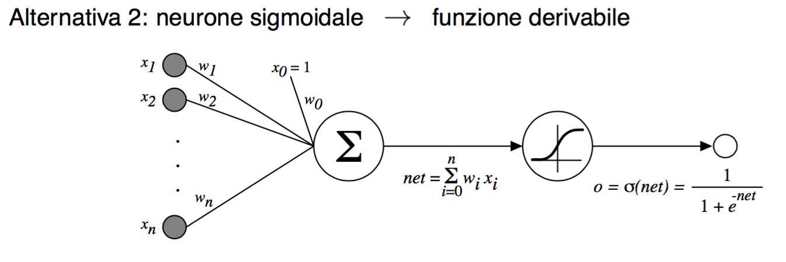

#Lezione 9 - Reti neurali

Due approcci principali per studiarle:

1. Riprodurre il cervello umano
    - Modellare tutto o parte del cervello umano in modo affidabile, concentrandosi non tanto sul comportamento ma sulla struttura
2. Estrarre i principi fondamentali di calcolo utilizzati dal cervello
    - replicare solamente il compratmento del cervello umano, concentrandosi nei principi fondamentali del calcolo che il cervello utilizza, al fine di produrre un sistema artificiale in grado di replicarli

Durante il corso ci concetreremo sul secondo approccio applicato al contesto dell'apprendimento supervisionato.

##Tipologie di reti

Le reti neurali differiscono per:

- Topologia della rete
- Funzionamento dei neuroni
- ...

##Quando usarle?

Quando si hanno tanti input numerici e discreti e si vuole effettuare una classificazione o regressione.

I dati di input possono anche contenere del rumore e la forma della funzione target è totalmente sconosciuta.

Il risultato finale non deve essere compreso da un esperto umano, il funzionamento della rete è una black-box.

Tipicamente vengono utilizzate quando non ci sono conoscenze a priori nel dominio.

##Reti neurali artificiali

Il cervello umano è sostituito da circa 10 alla 10 neuroni fortemente interconnessi tra loro (da 10 alla 4 a 10 alla 5 connessioni), il tempo di risposta di un neurone è di circa 0.001 secondi.

Considerando che per riconoscere il contenuto di una scena un unmano impiega circa 0.1 secondi, ne consegue che il cervello umano sfrutta pesantemente il calcolo parallelo: infatti, in questo caso, non pul effettuare più di 100 calcoli seriali.

I processori attuali fanno ancora fatica a lavorare in parallelo.

Una rete neurale artificiale è un sistema costituito da unità interconnesse che calclano funzioni numeriche, ci sono vari tipi di unità:

- le unità di input rappresentano le variabili di ingresso
- le unità di output rappresentano le variabili di uscita
- le unità nascoste rappresentano le variabili interne che codificano (dopo l'apprendimento) le correlazioni tra le variabili di input relativamente al valore di output che si vuole generare

E sulle connessioni tra le varie unità sono definiti dei pesi adattabili dall'algoritmo di apprendimento.

Ci sono due modi per replicare un neurone.

###Hard-threshold - iperpiano

L'idea è quella di avere un vettore di input (nodi d'ingresso) e da ogni nodo arriva un segnale xi, ognuno di questi segnali viene aplificato di un fattore wi.

C'è un primo elmento che effettua la sommatoria *net* di tutti i segnali d'ingresso considerando il loro peso, dove x0 per devinizione viene posto a 1.

Sul risultato *net* viene applciata una funzione gradino che ritorna -1 o 1 un base al segno di *net*.

Si può dimostrare che questo tipo di neurone definisce un iperpiano.

Questo perché la somamtoria a partire da i=1 può essere vista come un W trasposto x +w0 ed è la definizione precedentemente data di iperpiano.

###Sigmoidale

Utilizza la stessa sommatoria *net* alla quale viene applicata la funzione σ.

> σ(z) = 1 / (1 + e-z)

La funzione è continua e compresa tra 0 e 1.

Il vantaggio fondamentale di σ è che è una funzione derivabile e quindi permette di utilizzare l'algoritmo di **back propagation** che permette di fare apprendimento all'indietro usando più livelli di neuroni.

##Perceptron

È un singolo neurone con Hard Threshold, l'idea è quella di ridursi ad un iperpiano.

Quando facciamo apprendimento si cerca di trovare un valore ai vari pesi wi in modo da apprendere la funzione target (anche in questo caso viene utilizzato un training set).

###Implementazione di funzioni booleane

Ad esempio Percepton può implementare l'operatore or con gli ingressi y- € {0,1}n+1 (stringhe binarie), si possono usare come pesi w'0 = -0.5 e w'i = 1 per i=1...n.

In modo simile può essere implementato anche l'operatore and con w'0 = -n+0.5 e w'i = 1 per i = 1..n.

Si può anche realizzare l'operatore not con una singola connessione e con un unico peso negativo.

Un problema che il perceptron non riesce a risolvere è la xor.

###Apprendimento di funzioni linearmente separabili

Si può far apprendere a Perceptron delle funzioni linearmente separabili con un algoritmo che è garantito che termini.

Tuttavia se la funzione da apprendere non è linearmente separabile l'algoritmo non converge.

Dato un insieme di apprendimento Tr = {(x-,t), dove t € {-1,+1}}.

1. Inizializza il vettore dei pesi w al vettore nullo (con tutte le componenti a 0, possono anche essere random ma piccole)
2. Ripeti finché non si raggiunge un punto fisso:
    1. seleziona a caso uno delgi esempi di apprendimento (x-,t)
    2. se out = sign(w- * x-) != t allora w- = w- + (t-out)x-

Cioè per ogni esempio nel training set va a controllare il segno di del prodotto scalare tra x e i pesi, se questo non coincide con il valore di training è necessario adattare w in modo che anche per x venga calcolato il valore corretto.

In questo modo si riesce ad apprendere una funzione che per costruzione non commette nessun errore nel training set.

