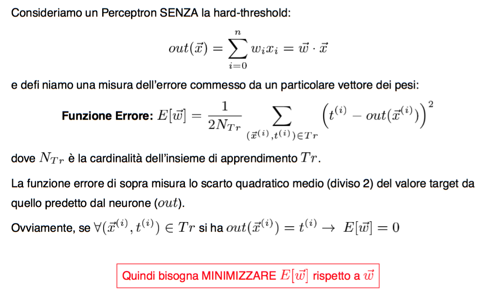
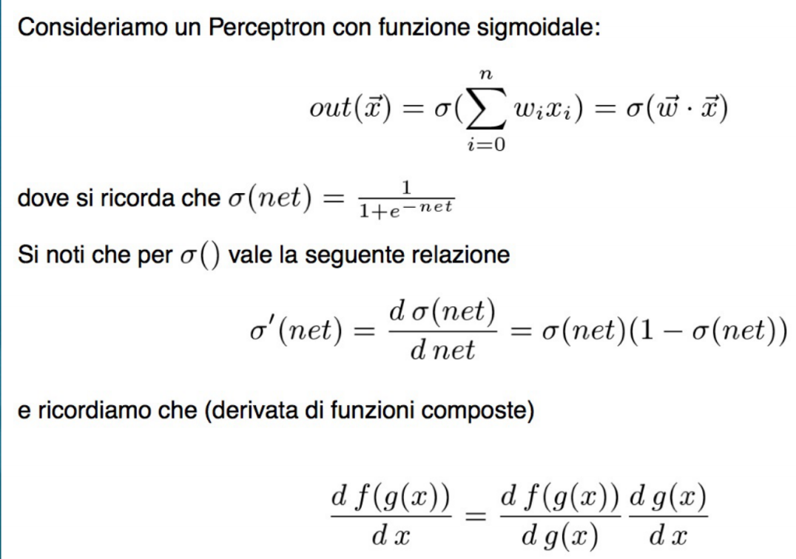
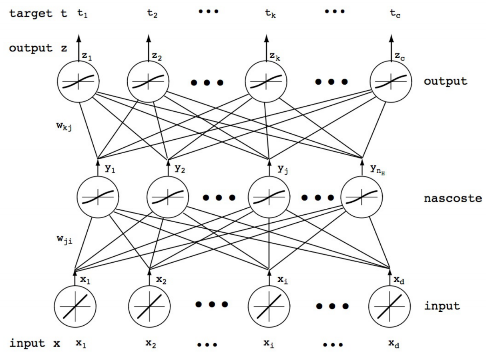
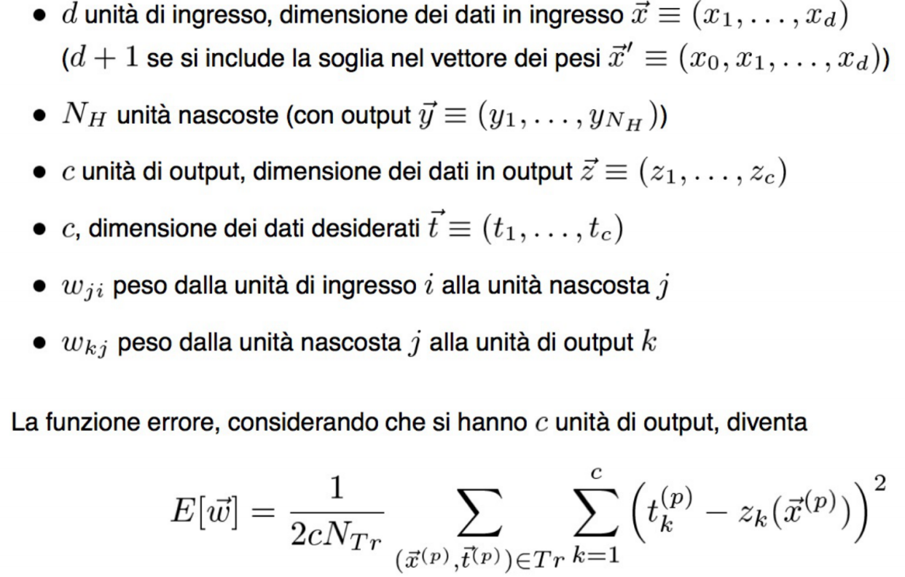
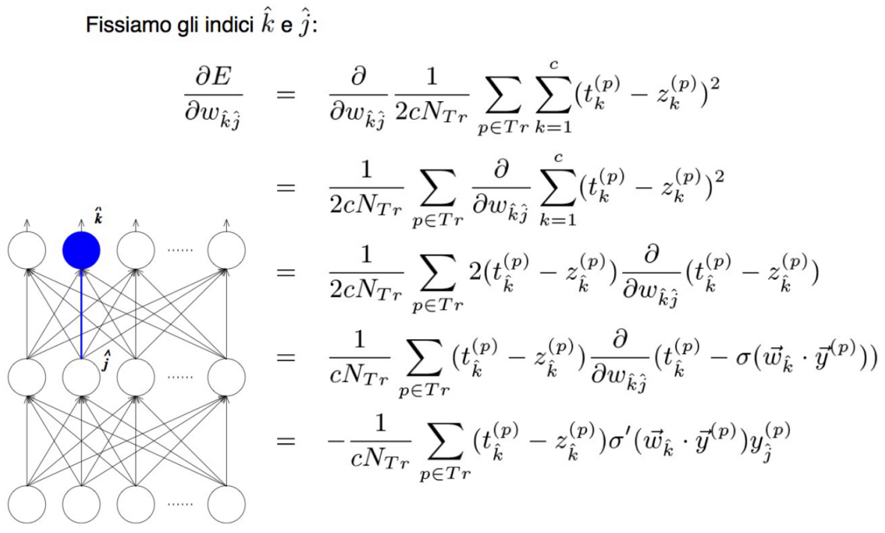
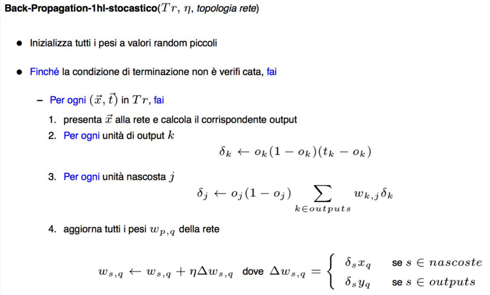

#Lezione 10

Perceptron va bene ma non riesce ad apprendere la XOR perché non è linearmente separabile.

## Reti di Perceptron

Una rete di Perceptron può apprendere qualsiasi funzione booleana.

Problema: come effettuare l’apprendimento di una rete di Perceptron?

Non si sa come assegnare pesi alle unità nascoste,una possibile soluzione e`quella di rendere il singolo neurone derivabile e sfruttare la tecnica di Discesa del Gradiente per apprendere i pesi "giusti".

###Discesa di gradiente

**Richiami di analisi**: il segno della derivata di una funzione determina se la funzione è crescente o decrescente. Inoltre se la derviata vale 0, la funzione in quel punto ha un minimo o un massimo locale.

Il core business della derivata è che noi possiamo seguire il segno della derivata per trovare dei valori più grandi per la funzione originale.

---

La funzione obbiettivo da minimizzare è la **funzione errore**, l'idea della funzione è di calcolare lo scarto quadratico medio del valore target predetto dal neurone (*funzione out*).

L'idea della disceza di grandiente è quello di spostarsi nella direzione contraria del gradiente in modo da ottenere il valore più piccolo della funzione obiettivo.

*-η* è lo step con il quale mi sposto.

Per calcolare lo spostamento rispetto ad ogni *w_i* per minimizzare la funzione obiettivo, vado a calcolare la derivata.

*out^(d)* e *t^(d)* si riferiscono all'esempio *d*-esimo nel training set.

####Algoritmo di apprendimento

*Δw_i* rappresenta lo spostamento dal w_i iniziale

In pratica prima viene esaminato tutti il training set per aggiornare i vari *Δw_i*, una folta finito di esaminare il training set si aggiornano i *w_i* e si riparte da capo.

Le condizioni di stop dell'algoritmo possono essere:

- *E(w)* minore di una soglia prefissata
- *Δw_i = 0 ∀i*
- Il numero di iterazioni ha superato una soglia prefissata. 

### Discesa di gradiente con sigmoide

Nell'ultimo conto c'è una ")" di troppo.

L'algoritmo di apprendimento è sempre lo stesso, cambia come vengono aggirnati i *Δw_i*.

##Rete di Perceptron

L'errore è l'errore quadratico medio di tutte le unità di output.

###Calcolo dei pesi per le unità di output

Calcoliamo i pesi per le unità di output, considerando i livelli nascosti come se fossero degli ingressi.

I *w_i* adesso diventano *w_k,j* perché i pesi sono come pesi da un'unità nascosta *j* all'unità di output *k*.

Nel secondo passo sono state fatte due operazioni, prima viene tolta la sommatoria, perché quando viene fatta la derivata della sommatoria c'è un solo elemento diverso da ed è quello di indice *k^=k*.

###Calcolo dei pesi per le unità nascoste

###Algoritmo di apprendimento

L'apprendimento viene fatto in due fasi, una **forward** nella quale si fa apprendimento sull'input, e una base **backward** nella quale si fa apprendimento sull'output. Ma non ne sono sicuro.

Il passo 2 rappresenta la fase **forward** mentre il passo 3 rappresenta la fase **backward**

Le possibili condizioni di terminazione sono le stesse che si hanno quando c'è un solo neurone.