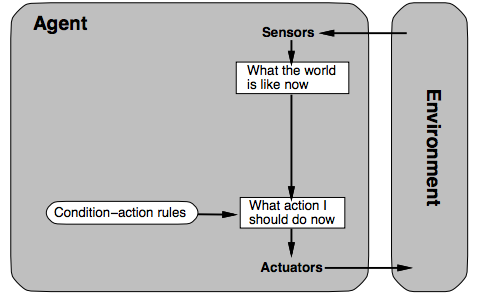
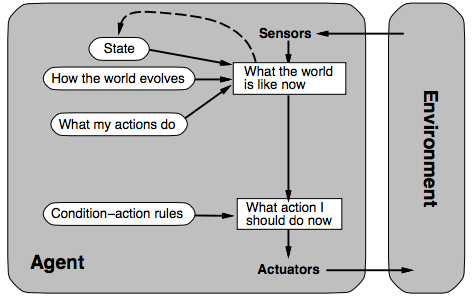
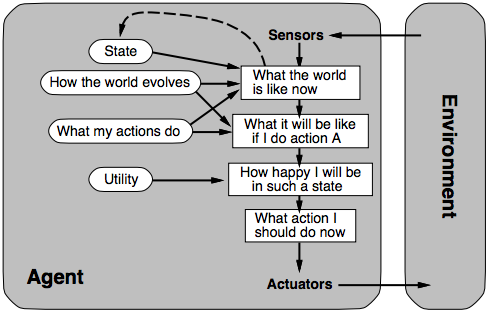
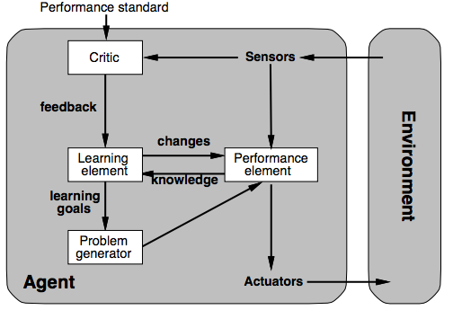

#Intelligenza Arificale - Lezione 2

_le slide vecchie sembrano migliori di quelle nuove._

##Esempio di agente intelligente

Bot che compra su internet.

- Misura di prestazioni: risparmio, affidabilità del venditore, tempo di spedizione;
- Ambiente operativo: motori di ricerca, siti di e-commerce, aste on-line;
- Attuatori: sistema di pagamento, indirizzo di spedizione e intestatario;
- Sensori: protocolli di accesso ad internet e di pagamento.

##Tipi di ambiente

Alcune caratteristiche degli ambienti possono permettere ipotesi semplificative, andando così ad influenzare la progettazione.

- **Osservabile**: si ha accesso a tutta l'informazione che caratterizza l'ambiente. Avere o non avere tutta l'informazione influisce nelle varie azioni, perché potrebbero essere intraprese delle decisioni solamente per ottenere ulteriori informazioni
- **Determinstico**: quando l'esecuzione di un'azione porta sempre lo stesso effetto nell'ambiente. Lavorare in un ambiente deterministioco è più semplice in quanto si riesce a prevedere i risultati.
- **Episodico**: _la percezione attuale dell'ambiente non è influenzata dallo storico delle percezioni._ Anche in questo caso, un ambiente episodico permette di effettuare alcune assunzioni semplificative in quanto non è necessario tenere conto dello storico delle percezioni. Se l'ambiente non è episodico è necessario tenere scegliere quante percezioni tenere in memoria, dal momento che non è possibile immagazzinarli tutti.
- **Statico** (o stazionario): se le relazioni tra le entità che definiscono il problema stesso restano intalterate o meno nel tempo.
- **Discreto**: se le quantità che vengono osservate sono discrete o continue.
- **Agente singolo**: c'è un solo agente che modifica l'ambiente o possono esserci più agenti che operano nello stesso ambiente?

Il mondo reale tipicamente è parzialmente osservabile, stocastico (non deterministico), sequenzaile, dinamico, continuo e multi-agente.

##Tipi di agenti

Un agente può essere visto come un'_architettura_ e _programma_ che permette di effettuare un'azione a seguito di una percezione (software specifico per un determinato problema).

Ogni agente può essere trasformato in un agente in grado di apprendere.

###Agente a riflesso (reattivi) semplice

Data una percezione si sa già che azione andare ad intraprendere

Il programma è una serie di regole `if-then-else` necessarie per scegliere l'azione da fare.

Questo tipo di agente è molto semplice da realizzare ed efficace, però funziona solamente nel caso le assunzioni fatte siano corrette.

Un miglioramento a questa tipologia di agente è quello di introdurre alcune scelte casuali, in modo da cercare di rompere alcuni loop infiniti.

###Agente a riflesso con stato

Per eseguire un'azione è necessario andare a considerare sia la percezione corrente, sia lo storico.

L'attivazione delle regole viene influenzata anche dallo stato interno.

In questo caso è però necessario che l'agente abbia conoscenza riguardo le leggi che regolano l'ambiente e come le azioni che svolge influenzano l'ambiente.

Sulla base di queste informazioni vengono poi applicate le regole per la scelta dell'azione da svolgere.

Si riesce quindi a gestire meglio situazioni parzialmente osservabile, tuttavia le scelte sono _hard coded_ nelle regole.

###Agenti basati su goal (obiettivi)

Agenti più flessibili che cercano di raggiungere un determinato obiettivo.

In questo caso le regole vengono sostituite da degli obiettivi.

La modifica principale sta nell'aggiunta di un componente che cerca di prevedere come il mondo cambia se vado ad effettuare una derterminata azione.

Viene quindi cercata la sequenza di azioni migliori da svolgere per raggiungere il proprio obiettivo, tenendo sempre in considerazione la percezione attuale dell'ambiente.

Ci sono però dei problemi nel caso il goal prefissato dall'agente non sia pienamente raggiungibile oppure ci sono più goal in constrasto tra loro.

###Agenti a misura di utilità

Agente che sceglie le azioni da intraprendere in modo che siano le più convenienti per una data misura di utilità.

Il concetto di goal viene sostituito da una funzione che calcola quando l'agente è _"contento"_ di essere in un determinato stato.

Quando viene valutato l'effetto dell'azione sull'ambiente si tiene conto anche di quanto quello stato è _"buono"_ per l'agente. Tenendo anche conto delle varie probabilità di raggiungere con successo lo stato.

##Agenti in grado di apprendere

Per garantire l'apprendimento deve essere presente un __elemento critico__ che sia in grado di valutare le azioni dell'agente in modo critico. Serve quindi un modo per valutare le prestazioni dell'agente.

L'emento critico genera quindi un feedback per l'__elemento di apprendimento__ che è quello che influenza il __performance element__.

Il performance element è l'elemento che decide quale azione andare a prendere in base alle informazioni ottenute dai sensori.

C'è anche un __problem geneator__ che fa in modo che tutte le casistiche possibili vengano affrontate dall'elemento di apprendimento, in modo che anche queste vengano considerate.

Questo perché l'apprendimento potrebbe essere come quello di uno studente, che cerca di imparare le domande tipiche di un compito, il problem generator è quello che genere le domande che non sono mai comparse in un compito.

Il problem generator risulta particolarmente importante nelle fasi iniziali.

##Ricerca in uno spazio di soluzioni

Esempio della vacanza in Romania.

__Goal:__ Andare a Bucharest;

__Stati:__ varie città rumene;

__Azioni:__ viaggi tra una città e l'altra;

Trovare una soluzione vuol dire quindi trovare una sequenza di viaggi che permette di raggiungere Bucharest in tempo.

###Formulazione di un problema (single state)

Un problema è definito da 4 elementi:

- __Stato iniziale__: stato iniziale, ad esempio 'Arad' (una citta della Romania).
- __Funzione successore__: funzione che dato uno stato fornisce tutti gli stati vicini allo stato dato e l'azione che permette di raggiungerli.
- __Test per il goal__: che può essere _esplicito_ (raggingo Bucharest) oppure può essere _implicito_ che descrive una caratteristica (città con una determinata officina), è una funzione che dato uno stato specifica se lo stato soddisfa o meno la proprità che mi interessa.
- __Costo di un cammino__: è la somma dei costi del cammino che sto considerando, a partire dallo stato iniziale fino allo stato attuale.

_Una soluzione è quindi una sequenza di azioni che conduce da uno stato iniziale ad uno stato di goal._

Questa formulazione è limitata in quanto non è possibile andare a specificare delle preferenze riguardo la ricerca delle città.

Tuttavia permette di astrarre il problema che risulterebbe troppo complesso nel mondo reale.

Nell'esempio della Romania vengono astratti sia gli stati sia le azioni, questo perché le città non sono un semplice punto ma hanno una certa aerea e allo stesso modo da una città all'altra posso essere disponibili molte più strade.

Di conseguenza anche la soluzione ottenuta sarà una soluzione astratta.

