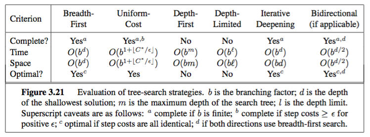

#Lezione 4 - Rircerca informata e non

Tabella riassuntiva delle proprietà degli algoritmi non informati:



##Ricerca non informata - stati ripetuti

Se non si utilizzano delle strategie per evitare di visitare più volte lo stesso stato si possono generare un numero esponenziale di stati.

Possono essere usate alcune strategie per gestire questo problema:

- Si può evitare di generare il nuovo nodo se lo stato del nuovo nodo è ugale allo stato del nodo corrente o di uno dei successori del nodo corrente. La complessità di questa strategia è costante o al più lineare rispetto al numero dei successori del nodo corrente. Se viene trovato due volte lo stesso stato è necessario aggiornare i costi in modo di tenere il nodo migliore. In questo modo non è garantita l'assenza di ripetizioni.
- Si può evitare di generare un nuovo nodo se ha lo stesso stato di uno degli avi (ha lo stesso stato di un nodo presente nel cammino che ha portato al nodo corrente). La complessità questa volta è lineare rispetto alla lunghezza del cammino e non garantisce ancora che lo stesso stato non venga ripetuto, dal momento che lo stesso stato può ancora comparire in due cammini diversi.
- Si può evitare di generare un nuovo nodo se è già stato generato (si può fare con una hash table). La complessità di questa strategia è lineare rispetto al numero totale degli stati, ma garantisce che lo stesso stato non venga incotrato più volte.

###Ricerca su grafo

Al posto di creare un albero con la replica degli stati si va a sostituire l'albero con un grafo dove i nodi rappresentano gli stati e gli archi sono dati dal collegamento dei due stati.

```
function RicercaGrafo(problema,frontiera) returns una soluzione o il fallimento
	chiuso = insieme vuoto //insieme dei nodi già esplorati
	frontiera = Inserisci(CreaNodo(StatoIniziale[problema])),frontiera)
	loop do
		if Vuoto(frontiera) then return fallimento
		nodo = RimuoviPrimo(frontiera)
		if TestObiettivo[problema](Stato[nodo]) then return Soluzione(nodo)
		if Stato[nodo] non è in chiuso then
			aggiungi Stato[nodo] a chiuso
			frontiera = InserisciTutti(Espandi(nodo,problema),frontiera)
	end
```

##Ricerca Informata

Nella ricerca non informata la strategia di ricerca delle soluzioni è data dall'ordine di espansione dei nodi.

Nella ricerca informata viene utilizzata una __funzione di valutazione__ f(n) per ogni nodo *n* che indica quanto è _desiderabile_ espandere il dato nodo.

In questo modo è possible utilizzare la funzione per ordinare la coda dei nodi dell frontiera secondo desiderabilità.

La ricerca _greedy_ e _A*_ utilizzano questi ragionamenti.

Nell'esempio del viaggio da Arad a Bucharest la distanza della soluzione ottima non può essere minore della distanza in linea d'aria.
Inoltre, le città intermedie migliori sono quelle più vicine in linea d'aria alla destinazione.

Tenendo conto di queste considerazioni è possibile utilizzare una funzione di valutazione che dato uno stato ritorni la distanza in linea d'aria dal dato stato a Bucharest.

###Rircerca Greedy

Utilizza una funzione di valutazione definita sulla base di una funzione euristica.

> **h(n)** = stima del costo dal nodo n al goal più vicino

La ricerca greedy espande il nodo che __appare__ essere il più vicino al goal, senza tenere traccia del cammino effettuato.

Questa ricerca **non è completa** in quanto può rimanere intrappolata nei cicli. Se viene introdotto un controllo per gli stati ripetuti può diventare completa (gli stati devono comunque essere finiti).

Il tempo è O(b<sup>m</sup>) dove m è la profondità della soluzione ottima, ma l'utilizzo di una buona euristica può portare dei miglioramenti.

Lo stesso discroso vale per lo spazio in quanto per ogni nodo deve essere tenuta la stima della funzione di valutazione.

Non è inoltre garantito che la soluzione trovata sia ottima.

###Ricerca A*

L'idea alla base è quella di evitare di espandere cammini che sono già costosi.

> **f(n)** = h(n) + g(n)
> 
> **h(n)** --> funzione euristica per il costo dal nodo n al goal
> 
> **g(n)** --> costo sostenuto per raggiungere il nodo (n)
> 
> **f(n)** --> costo totale stimato del cammino che passa da n al goal

A* usa una euristica _ammissibile_, cioè la funzione h(n) è una sottostima di h*(n) (costo effettivo per raggiungere il nodo goal a partire da n).

La funzione h(n) deve ritornare sempre un valore >= 0 altrimenti si potrebbero avere dei problemi, in quanto un costo non può essere negativo (il costo non negativo permette di non preoccuparsi degli stati ripetuti).

Di conseguenza la ricerca A* su un albero è **ottima**.

Durante l'esecuzione di A* può comparire all'interno della frontiera un nodo goal, tuttavia se c'è un nodo che viene stimato di costo inferiore, viene espanso quello al posto del nodo goal.
Questo perché A* cerca la soluzione ottima.

####Ottimalità di A* (su un albero)

Supponiamo che un goal sub-ottimo G<sub>2</sub> sia stato generato e che si trovi nella coda (frontiera).

Sia n un nodo non ancora espanso su un cammino minimo verso il goal ottimo G.

> f(G<sub>2</sub>)	= g(G<sub>2</sub>)	-- perché h(G<sub>2</sub>) = 0
>
> f(G<sub>2</sub>)   > g(G)		-- perché G<sub>2</sub> non è ottimo
> 
> f(G<sub>2</sub>)	>= f(n)	-- perché h è ammissibile

A* quindi non selezionerà mai G<sub>2</sub> per l'espansione e di conseguenza verrà estratto prima G di G<sub>2</sub>.


