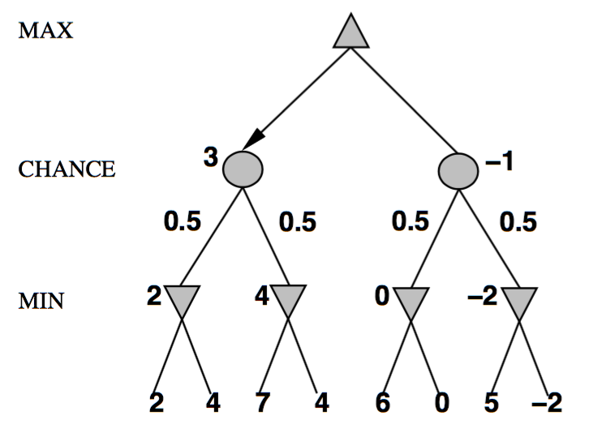

#Lezione 10 - Giochi non deterministici e ad infomrazioni parziale

##𝜶-𝜷 pruning (best case)

Per avere il valore esatto di uno stato occorre conosce il valore estatto di utilità per uno stato figlio e conosce un bound sull'utilità di tutti gli stati figli rimanenti.

Mentre per derivare un buond sull'utilità di uno stato occorre conoscere il valore esatto di utilità di ogni stato figlio.


- *d*: distanza in ply dagli stati terminali
- *E(d)*: minimo numero di stati da considerare (esplorare) per conoscere il valore esatti di utilità di uno stato ad una distanza *d* play dalla frontiera
- *B(d)*: numero minimo di stati da considerare per conoscere il bound sul valore di utilità di uno stato a distanza *d* ply dalla frontiera.

> E(d+1) = E(d) + (b-1)B(d)
> 
> B(d+1) = E(d)

Espandendo per *E(d+2)*

> E(d+2) = E(d+1) + (b-1)B(d+1)
> 
> E(d+2) = (E(d) + (b-1)B(d)) + (b-1)E(d)
> 
> E(d+2) = bE(d) + (b-1)B(d)
> 
> E(d+2) = bE(d) + (b-1)E(d-1)

Considerando che *E(0) = B(0) = 1* e che *E(d-1) < E(d)*, ottengo che:

> E(d+2) < 2bE(d)

Da cui trovo che generalmente

> E(m) < (2b)<sup>m/2</sup> 

##Giochi non deterministici

Sono giochi in cui sono presenti degli eventi casuali (*chance*) introdotti mediente dadi, carte prese a caso, lancio in una moneta, ecc.

Nei giochi deterministici si riesce a propagare il valore di utilità dalle foglie ai nodi interni, mentre nei giochi non deterministici, a causa del non determinismo, non si riesce ad avere la certezza ma una probabilità.

Nell'albero viene introdotta una nuova tipologia dei nodi detti *chance* e che Max utilizza per valutare la mossa da fare.



Il valore aspettato di uno nodo chance dipende dalla probabilità dei vari valori dei figli del nodo chance.

La strategia sta quindi nel scegliere le mosse che massimizzano il valore aspettato di utilità.

La presenza dei nodi chance fa aumentare il numero di nodi dell'albero, perché adesso data una mossa di Max ho due o più possibili mosse di Min.

###ExpectMiniMax

Funziona come Minimax con l'eccezione che si devono trattare anche gli eventi casuali.

```
...
if state is a Max node then
    return the highest ExpectiMiniMax-Value of Successors(state)
if state is a Min node then
    return the lowest ExpectiMiniMax-Value of Successors(state)r
if state is a Chance node then
    return average ExpectiMiniMax-Value of Successors(state)
...
```

### Potatura in alberi da gioco non deterministici

Si riesce comunque a fare una potatura 𝜶-𝜷 solo che risulta meno efficace.

### Giochi non deterministici in pratica

L'uso dei dadi aumenta il valore del fattore di branching *b* e questo va ad influire sul valore di lookahead.

Nonostante la complessità aumenti si riesce comunque ad ottenere dei risultati buoni (sfruttando anche alcune cose non ancora affrontate).

In questo caso è importante che la funzione di valutazione sia composta da trasformazioni lineari e positive, altrimenti non si riesce a preservare l'ordine dei nodi chance.

Nei giochi deterministici basta che la funzione di valutazione sia monotona.

## Giochi ad informazione parziale

In questa tipologia di giochi non si hanno tutte le informazioni riguardo le mosse che può fare l'avversario (esempio tipico sono i giochi di carte).

C'è stata la proposta di ridurre questi giochi in giochi non deterministici, considerando tutte le possibili smazzate come se si avesse un dado con tante facce.

Questa strategia funziona, ma non è corretta.

Perché nel caso di informazione parziale una strategia ottima potrebbe fare delle mosse solamente per acquisire ulteriori informazioni, mentre nel caso non deterministico questa tipologia di mosse non viene presa in considerazione in quanto si da per scontato di avere a diposizione tutta l'informazione.

È più corretto che il valore di un azione dipenda dallo stato di informazione o **stato di credenza** in cui si trova l'agente ed è possibile generare e ricercare all'interno di un albero di stati di credenza.

Questo conduce a comportamenti razionali quali:

- Agire con lo scopo di ottenere infomrazione;
- Trasmettere informazione al proprio compagno di gioco;
- Agire in modo casuale per minimizzare la perdita di informazione (fornire informazioni agli avversari).

## Riassumendo i giochi

I giochi sono stati i primi esempi di intelligenza artificiale, si è partiti dai giochi deterministici sfruttando anche lo sviluppo tecnologico.

Le cose si complicano notevolmente quando l'informazione è parziale o il gioco non è deterministico.

L'approssimazione risulta quindi molto importante dal momento che non è possibile raggiungere la perfezione per motivi computazionali.