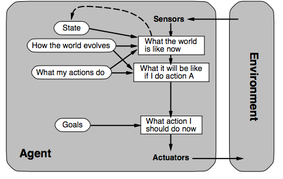

#Lezione 11 - Agenti logici



Logica proposizionale: vengono associati dei simboli a ...

##Base di conoscenza

Un agente logico è composto da due componenti che possono essere modificati:

- Inference Engine (motore inferenziale): è indipendete dal dominio applicativo e permette di utilizzare un linguaggio dichiarativo in quanto è in grado di andare a valutare dei simboli.
- Knowledge base (base di conoscenza): contiene le informazioni specifiche del problema.

Queste due parti sono tra loro intercambiabili, lo stesso motore inferenziale può essere utilizzato in più domini specifici e allo stesso modo la stessa base di conoscenza può essere trattata da vari tipi di motori inferenziale disponibilie.

**Base di conoscenza**: insieme di sentenze espresse in un linguaggio formale che permette di utilizzare un approccio dichiarativo per definire degli agenti logici.

Sulla base di conoscenza è possibile eseguire un `Tell` o `Dire` per aggiungere informazioni alla base di conosceza oppure è possibile andare a cercare delle inforazioni `Ask` o `Chiedere`.

Ogni agente può essere descritto al *livello di conoscenza* cioè per quello che sanno e indipendentemente dall'implementazione oppure a *livello implementativo* così considerando le stutture dati e gli algoritmi che le manipolano.

## Agente bastato sulla conoscenza

```
funciton KB-Agente(percezione) retruns una azione
    static: KB, una base di conoscenza
            t, un contatore inizializzato a 0 che indica il tempo
    Tell(KB, CostruisciFormulaPercezione(percezione, t))
    azione <- Ask(KB, CostruisciInterrogazioneAzione(t))
    Tell(KB, CostruisciForumlaAzione(azione, t)
    t <- t +1
    return azione
```

L'agente deve essere capace di:

- Rappresentare stati, azioni, ecc.
- Incorporare nuove percezioni
- Aggiornare le rappresentazioni interne del mondo (ambiente)
- Dedurre proprietà nascoste del mondo
- Dedurre le azioni appropriate da intraprendere

## Il magico mondo dei Wumpus

**PEAS**: Performance Enviroment "Attuatori" Sensors.

**Misura della prestazione**: +1000 Oro, -1000 Morte, -1 per ogni spostamento, -10 per l'uso della freccia.

**Ambiente**: Scacchiera 4x4 con determinate caratteristiche (vedi slide)

**Attuatori**: Spostamento a DX/SX/UP/DOWN, prendi, lascia, lancia freccia.

**Sensori**: Brezza, Luccichio, Puzza.

Questo ambiente:

- **Non è osservabile**: si hanno solo percezioni locali per la casella su cui ci si trova.
- **Deterministico**: i risutlati delle azioni sono specificati.
- **Episodico**: no, è necessario scegliere una sequenza di azioni.
- **Statico**: sia il Wumpus sia le trappole non si muovono.
- **Discreto**
- **Agente singolo**: il Wumpus fa parte dell'ambiente.

Per muoversi nell'ambiente l'agente deve valutare se è sicuro spostarsi in una determinata cella in base alle percezioni che ha nello stato corrente.

In base a queste percezioni deve essere in grado di inferire quali sono le mosse sicure per poi sceglierne una di queste.

In alcune situazioni non è possibile andare ad inferire la pericolosità di una mossa, in questo caso è necessario passare all'**inferenza probabilitstica**. (Vado a caso ma con il buon senso).

In altri scenari, come quando subito all'inizio si percepisce la puzza del Wumpus, si possono usare strategia di **coercizione**.
In questo caso si sa che c'è un Wumpus vicino e si lancia una freccia. Se dove ho lanciato la freccia c'era il Wumpus, questo ora è morto ed è possibile andarci, se invece la freccia è andata a vuoto, ho solamente sprecato la freccia ma ho la certezza che il quadrato è sicuro.

## Modelli

I logici tipicamente pensano in termini di modelli, che formalmente sono mondi strutturati rispetto ai quai si può valutare se un'affermazione è vera o falsa.

Diciamo che *m* è un modello di una sentenza 𝜶 se 𝜶 è vera in *m*.

*M(𝜶)* è l'insieme di tutti i modelli di 𝜶.

Allora KB (KnowledgeBase) |= 𝜶 se e sole se *M(KB) ⊆ M(𝜶)* (𝜶 è deducibile dalla base di conosceza).

Questo perché la KB può essere vista come una concatenazione di varie sequenze.

Per verificare la deducibilità è necessario andare ad enumerare tutte le possibili combinazioni. Il che vuol dire che se 𝜶 contiene *n* simboli è necessario verificare tutte le 2<sup>*n*</sup> combinazioni.

Si assume sempre che la base di conoscenza sia vera. In questo modo si può dedurre i letterali 𝜶 dalla base, da notare anche che se KB|=𝜶 allora si sa che 𝜶 è vera, però se KB|/=𝜶 allora non si sa se 𝜶 è vera o falsa.

### Modellazione per il Wumpus (lite)

P_i,j = vero se c'è una trappola in (i,j)

B_i,j = vero se c'è brezza in (i,j)

Codifica di alcune percezioni:

- not(P_1,1)
- not(B_1,1)
- B_2,1

Codifica della brezza causata dalla trappole:

- B_1,1 sse (P_1,2 \/ P_2,1)
- B_2,1 sse (P_1,1 \/ P_2,2 \/ P_3,1)
- ...

Con queste informazioni è possibile andare a creare una tabella di verità, con le colonne per i vari letterali, le informazioni presenti nella base di conoscenza e una colonna per l'affermazione 𝜶_1 che vogliamo dedurre.

*Immagine slide pagina 32*

Per controllare l'inferenza di 𝜶_1 è necessario andare a verificare tutti i possibili valori di verità.

### Inferenza per mezzo di enumerazione

Enumerazioni a scandaglio (depth first) di tutti i modelli, è un algoritmo corretto e completo.

```
function TVImplica?(KB, 𝜶) returns true o false
    s <- una lista di simboli proposizioniali contenuti sia in KB che 𝜶
    return TVVerificaTutto(KB, 𝜶, s, [])

function TVVerificaTtto(KB, 𝜶, s, modello) returns true oppure false
    if Vuoto(s) then
        if CPVero(KB, modello) then 
            return CPVero(𝜶, modello)
        else
            return true
    else do
        P <- Primo(s); resto <- Resto(s)
        return TVVerificaTutto(KB, a, resto, Estendi(P, true, modello)) and TVVerificaTutto(KB, 𝜶, resto, Estendi(P, false, modello))    
```

## Metodi di prova

Ci sono due tipologie di prove che si possono fare:

- **Model Checking**: viene fatta l'enumerazioe delle tabelle di verita, con una complessità esponenziale in *n* (numero di simboli nella KB), può essere migliorata con euristiche o Hill climbing, ma in questo caso si perde la completezza.
- **Applicazione di regole di inverenza**: si inizia ad estendere la base di conoscenza utilizzando i dati attuali, se 𝜶 è tra queste nuove sentenze allora viene inferito, altrimenti ripeto il passo utilizzando le nuove informazioni inferite. L'utilizzo di questa strategia risulta più efficiente ma le sentenze devono essere scritte in una forma normale.