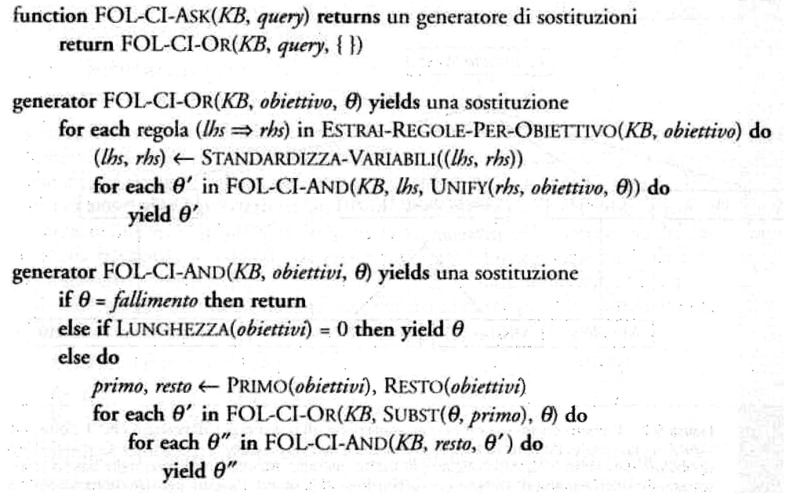

#Lezione 16 - Backward Chaining e Prolog

##Backward Chainging

**manca la parte introduttiva**



L'algoritmo ritorna un generatore di sostituzioni e il calcolo parte dalla generazione degli OR.

Per ogni regola che è rilevante per il predicato convinlto nell'obiettivo, viene prima fatta la standardizzazione e poi per tutte le sostituzioni che sono state generate dagli AND.

...

La complessità in spazio è lineare con la dimensione della prova ma c'è il rischio di effettuare cicli infiniti, è quindi necessario andare a controllare che il goal corrente non sia già nella pila dei goal.

L'algoritmo può essere inefficente a causa di sottogoal ripetuti, conviene quindi tenere una cache che contiene i risultati già calcoalti.

Prolog non utilizza questi due miglioramenti.

##Programmazione Logica: Prolog

Come anticipato utilizza backward chaining con clausole di Horn.

Un programma Prolog è un'insieme di clausole, la nostra base di conoscenza.

Le clausole sono scritte "al contrario":

```
test :- letterale_1, letterale_2, ..., letterale_n.

criminal(X) :- american(X), weapon(Y), sells(X,Y,Z), hostile(Z).
```

Da notare che le vaariabili sono scritte in maiuscolo e i predicati tutti in minuscolo.

I fatti vengono rappresentati come predicati senza implicazione.

```
american(West).
```

Una volta inserita la base di conoscenza vengono inviate delle query al programma. La ricerca in backward viene fatta real time.

Trammite **open coding** può essere migliora l'unificazione diminuendo il tempo necessario alla ricerca delle sostituzioni.

Prolog esegue il backward chaining in *depth first, left to right*. Questo è importante per vari motivi, ad esempio con una regola ricorsiva è necessario definire prima il caso base e poi l'invocazione ricorsiva.

È possibile usare l'operatore `is` per assegnare un valore a delle variabili e di utilizzare alcune espressioni aritmetiche.

**assunzione del mondo chiuso**: tutto quello che fallisce risulta essere negato. Se la dimostrazione che la query sia implicata dalla KB fallisce, allora la query viene considerata come falsa.

###Esempio di programma

```
append([],Y,Y).
append([X|L], Y, [X|Z]) :- append(L,Y,Z).
```
L'operatore `|` su una lista separa il primo elemento dal resto della lista.

La prima clausola dice che l'append ad una lista vuota di una variabile da come risultato la variabile stessa.

La seconda regola dice che data una lista con almeno un elemento e una lista Y, la concatenazione è una lista che inizia co il primo elemento e che continua con una lista. Questa lista è ottenuto partendo concatenando il resto della prima lista e la lista `Y`. 

Quindi se `Z` è l'append di `L` con la lista `Y`, `[X|Z]` è l'append di `[X|L]` con `Y`.

Su questa base di conoscenza è possibile fare la query `append(A,B,[1,2])?`, cioè chiedere se `[1,2]` è la concatenazione di `A` e `B`.

Prolog esegue quindi l'unificazione secondo l'ordine in cui compaiono le clausole:

```
append(A,B,[1,2])?
append([],Y,Y)

𝜃 = {A/[], B/Y, Y/[1,2]}
```

Vengono però ritornate solamente delle sostituzioni che hanno variabili della query, quindi `𝜃 = {A/[], B/[1,2]}`.

Dopodiché si continua a cercare, assumendo che quelle già valutate siano fallite, in modo da trovare altre soluzioni

```
append(A,B,[1,2])?
append([X|L], Y, [X|Z]) :- append(L,Y,Z).

𝜃_2 = {A/[X|L], B/Y, X/1, Z/[2]}

Il nuovo goal diventa quindi:

append(L,Y,[2])? //Adesso si riparte da capo con il processo di ricerca
append([],Q,Q) 

𝜃_2,1 = {L/[], Y/Q, Q/[2]} = {L/[], Y/[2]}

Viene quindi composta 𝜃_2 con 𝜃_2,1

𝜃_2 𝜸 𝜃_2,1 = {A/[1|[]], B/[2]} = {A/[1], B/[2]}

Dopodiché assumo falsa la clausola usata e ne provo un'altra

append(L,Y,[2])?
append([X|F], G, [X|Z]) :- append(F,G,Z)

𝜃_2,2 = {L/[X|F], Y/G, [X|Z]/[2]} = {L/[2|F], Y/G, X/2, Z/[]}

Il nuovo goal diventa quindi: 
append(F,G,[])? e si riparte da capo
append([], K, K)

𝜃_4 = {F/G, G/K, K/[]} = {F/G, G/[]}

Combinando 𝜃_4 e 𝜃_2_2 = {...}

Bisogna poi assumere falsa la prima clausola e provare con la seconda.
Durante la ricerca con la seconda non si riesce a trovare una sostituzione, l'algoritmo quindi temrina.
```

*Tutte le ricerche dovrebbero essere standardizzate con un pedice e non con le lettere, per motivi pratici questo non viene fatto nell'esempio.*

Le variabili della query possono essere istanziate a piacere. Ad esempio alla query `append([],[1],[1])?` Prolog risponde con un `True`.