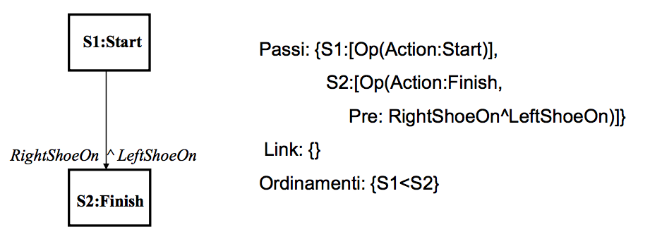
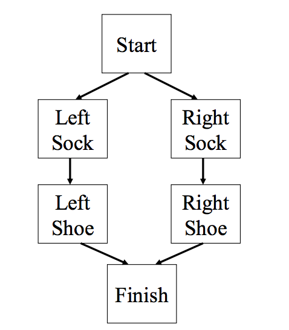
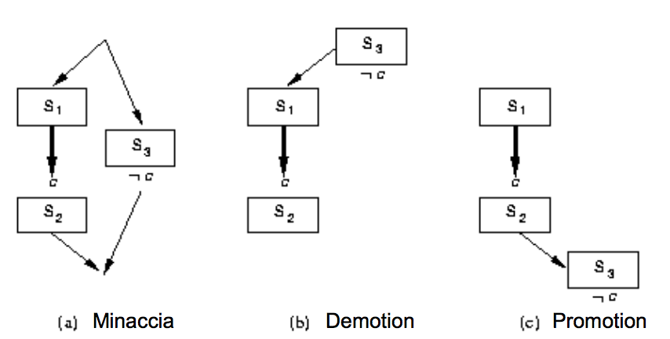
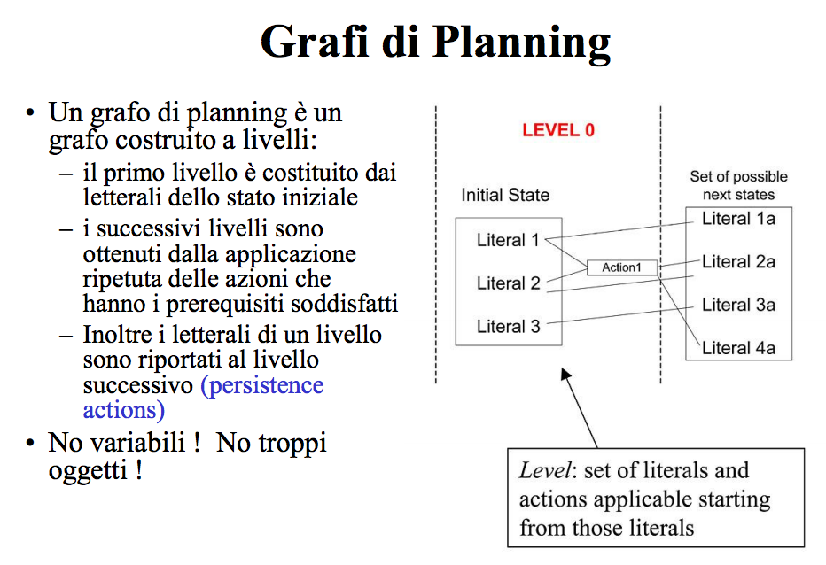

#Lezione 21 - Planning 3

STRIPS non tiene in considerazione il concetto di "piano ottimo" quindi la soluzione che fornisce non è detto che sia ottima.

##Problemi non risolvibili.

```
Goal: On(a,b), On(b,c)
Stato: On(b,table), On(a,table), On(c,a), clear(b), clear(c), handempty. 

Goal: On(a,b), A[Stack(b,c)], Holding(b), Clear(c)
Stato: On(b,table), On(a,table), On(c,a), Clear(b), Clear(c), handempty. 

Goal: On(a,b), A[Stack(b,c)], Holding(b)
Stato: On(b,table), On(a,table), On(c,a), Clear(b), Clear(c), handempty. 

Goal: On(a,b), A[Stack(b,c)], A[Pickup(b)], handempty, Clear(b), On(b,table)
Stato: On(b,table), On(a,table), On(c,a), Clear(b), Clear(c), handempty. 

Goal: On(a,b), A[Stack(b,c)], A[Pickup(b)]
Stato: On(b,table), On(a,table), On(c,a), Clear(b), Clear(c), handempty. 

Goal: On(a,b), A[Stack(b,c)]
Stato: On(a,table), On(c,a), Clear(c), not(handempty), not(Clear(b)), holding(b), not(on(b,table)). 

Goal: On(a,b)
Stato: On(a,table), On(c,a), not(on(b,table)), On(b,c), not(clear(c)), not(holding(x)), clear(x), handempty.

Goal: A[Stack(a,b)], Holding(a), Clear(b)
Stato: On(a,table), On(c,a), not(on(b,table)), On(b,c), not(clear(c)), not(holding(x)), clear(x), handempty.

...
```

Per ottenere `Clear(b)`, si può fare `Unstack(b,c)` invalidando il goal precedentemente ottenuto per poi andare a ricostruire il goal `On(b,c)`.

C'è però il rischio di cliclare (**anomialia si Sussman**) in quanto i due sottogoal non sono tra loro indipendenti.

Inoltre, se il problema prevede il consumo di risorse può essere che STRIPS non sia in grado di risolverlo, questo perché cerca di ottenere subito un ordine totale delle azioni.


##Ricapitolando

Un piano è una soluzione trovata cercando tra le situazioni goal.

La ricerca può essere fatta con un **planner progressivo**, che cerca il goal in avanti a partire dallo stato iniziale, o da un **planner regressivo**, che cerca un piano a partire dal goal.

##Planning nello stato dei piani

L'alternativa è una ricerca attraverso lo spazio dei piani, piuttosto che delle situazioni.

Questa ricerca parte da un **piano parziale** che non fa nulla, che viene espanso e raffinato fino a raggiungere un piano completo che risolve il problema.

Il raffinamento avviene mediante degli **operatori di raffinamento** che aggiungono vincoli ad un piano parziale modificano l'ordine delle azioni o aggiungendone di nuove.

##Partial order planning (POP)

Un planner lineare costruisce un piano come una sequenza totalmente ordinata di passi, mentre un planner non lineare (POP), costruisce un piano come un insieme di passi con alcuni vincoli temporali.

Vengono quindi utilizzati dei vincoli del tipo *S1 < S2* per specificare che *S1* deve essere eseguito prima di *S2*.

Il raffinamento avviene quindi aggiungendo dei nuovi passi al piano oppure aggiungendo dei vincoli tra i passi già presenti nel piano.

La soluzione così ottenuta rappresenta un ordinamento parziale che può essere sempre convertito in un piano totalmente ordinando utilizzando un ordinamento topologico tra i vari passi.

I planner non lineari incorporano il principio del **minimo impegno**, cioè scelgono solo quelle azioni, ordinamenti e assegnamenti di variabili che sono assolutamente necessari, rimandando le altre scelte al futuro. Non vengono inoltre prese decisioni premature su aspetti non rilevanti per raggiungere il goal.

Confrontanto i due approcci:

- Un planner lineare sceglie sempre di aggiungere un passo in
un punto preciso della sequenza
- Un planner non-lineare sceglie di aggiungere un passo ed
eventualmente qualche vincolo temporale fra passi

###Struttura di un piano non lineare

1. Insieme di passi {S<sub>1</sub>,S<sub>2</sub>, ...}, ognuno dei quali ha la descrizione di un operatore, precondizioni e postcondizioni.
2. Un insieme di link causali {... *(S<sub>i</sub>,C,S<sub>j</sub>)* ...}, che specificano che uno dei propositi del passo *S<sub>i</sub>* è di raggiungere la condizione *C* del passo *S<sub>j</sub>*.
3. Un insieme di vincoli di ordinamento {... *S<sub>i</sub> < S<sub>j</sub>* ...} che specificano che il passo *S<sub>i</sub>* deve venire eseguito prima di *S<sub>j</sub>*.

Un piano non lineare è **completo** se e solo se:

- Ogni passo (2) e (3) si trova nell'insieme (1).
- Se *S<sub>j</sub* ha un prerequisito *C*, allora esiste un link causale in (2) con la forma *(S<sub>i</sub>, C, S<sub>j</sub>)*.
- Se *(S<sub>i</sub>, C, S<sub>j</sub>)* è in (2) e il passo *S<sub>k</sub>* è in (1) e *S<sub>k</sub>* "**minaccia**" *(S<sub>i</sub>, C, S<sub>j</sub>)*, cioè rende falso *C*, allora (3) contiene *S<sub>k</sub>\<S<sub>i</sub>* o *S<sub>k</sub>\>S<sub>j</sub>*.

Ogni piano inizia allo stesso modo con un passo *S<sub>1</sub>:Start* e un *S<sub>2</sub>:Finish*.



Un piano ottenuto in questo modo può essere rappresentato graficamente con:



###POP - Vincoli e euristiche

Per popolare un piano non lineare si torna a fare una ricerca nello spazio dei piani.

Una strategia di ricerca è quella greedy che aggiunge solo passi che soddisfano una precondizione correntemente non soddisfatta. La filosofia del minimo impegno prevede poi di non ordinare i passi a meno che non sia strettamente necessario.

Bisogna poi tenere conto dei link causali *(S<sub>i</sub>, C, S<sub>j</sub>)* che *proteggono* una condizione *C*, quindi non deve essere mai aggiunto un passo intermedio *S<sub>k</sub>* tra *S<sub>i</sub>* e *S<sub>j</sub>* che invalida *C*.
Se un'azione parallela minaccia (**threatens**) *C*, cioè ha l'effeto di negare *C* (clobbering) è necessario risolvere la minaccia aggiungendo dei vincoli temporali. Si parla di **demotion** se viene posto *S<sub>k</sub> \< S<sub>i</sub>* oppure di **promotion** se *S<sub>k</sub> \> S<sub>j</sub>*.



Un piano viene detto **consistente** se non ci sono cicli e non c'è un conflitto tra chi soddisfa e chi minaccia. 

Se ogni precondizione di tutte le azioni del piano sono soddisfatte e nessun passo intermedio le invalida, allora il piano si dice anche **completo**.

Per rimuovere un conflitto si può aggiungere un vincolo d'ordinamento oppure aggiungere delle nuove azioni.

Nella costruzione di un piano è possibile utilizzare un'euristica simile alla **most constrained variable** dei CSP, con la differenza che si sceglie di soddisfare per prima la precondizione non raggiunta che può essere soddisfatta nel minor numero di modi possibile.

###Proprietà di POP

L'algoritmo non è deterministico, se si verifica un fallimento si fa backtracking sui punti di scelta (*choice point*), questi possono essere la scelta di passo per raggiungere un sotto-obiettivo o la scelta di demotion o promotion in caso di minaccia.

POP è **corretto**, **completo** e **sistematico** (non ci sono ripetizioni), inoltre può essere esteso rappresentando le azioni nella logica del primo ordine.

L'algortimo risulta efficente se utilizza delle euristiche derivate dalla descrizione del problema, altrimenti c'è la solita esplosione combinatoria.

C'è quindi la necessità di avere delle buone euristiche e non è semplice derivare delle euristiche ammissibili.

Uno strumento utile per ottenere queste euristiche è il grado di planning, il quale raccoglie informazioni su quali piani sono impossibili non prendendo in considerazione le minacce e non considerano il "*consumo*" dei letterali che chiudono le precondizioni (il consumo di un letterale si ha quando l'esecuzione di un'azione cambia il valore del letterale).

Questi grafi permettono quindi di sapere se non c'è soluzione ad un problema di pianificazione.




