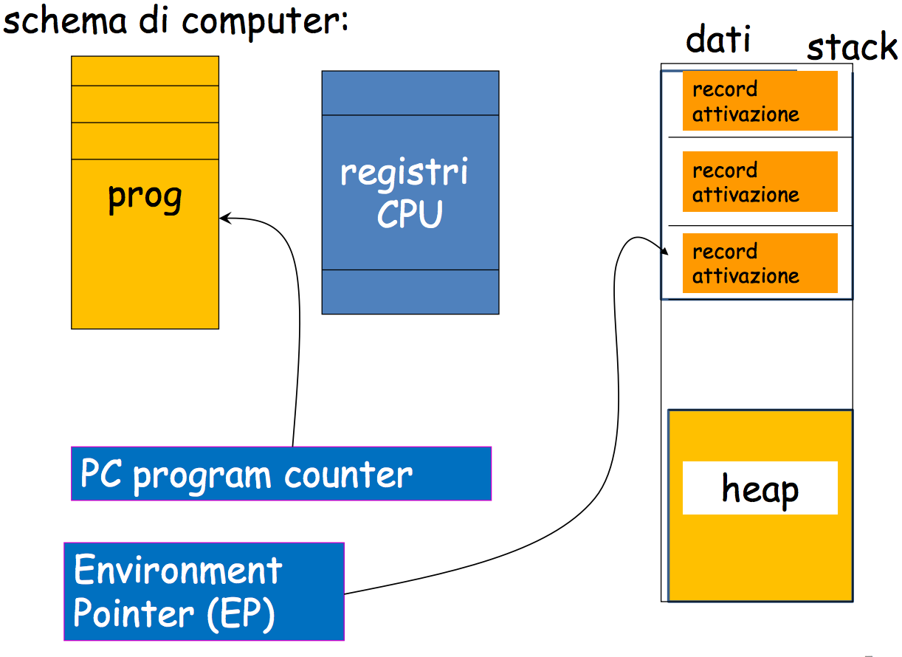
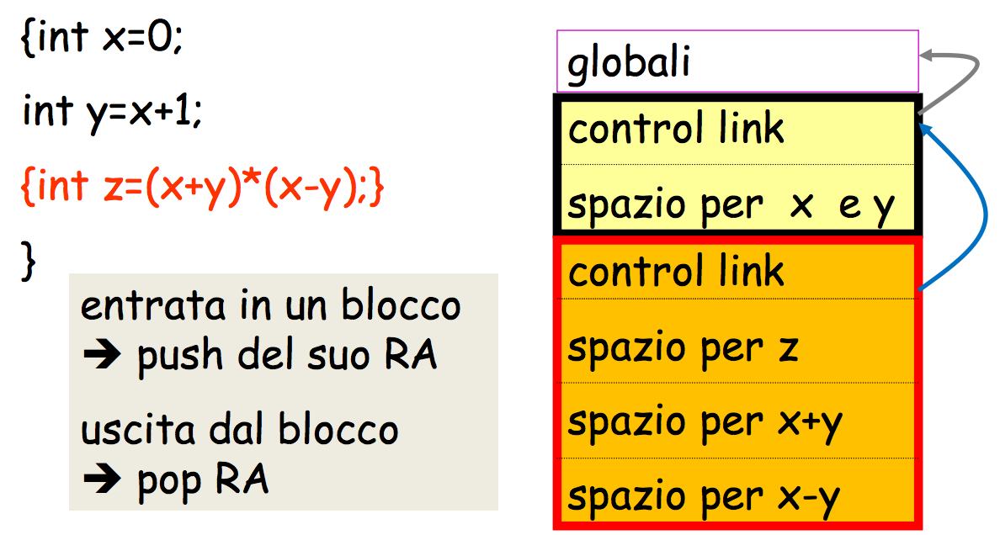

#Lezione 10 - Gestione dei dati a Runtime

*Capitolo 7 del libro.*

Fortran nel 60 non permetteva invocazioni ricorsive, ogni variabile e ogni parametro formale avevano una locazione fissa che conteneva il valore.

Questa strategia di gestione della memoria non permette di andare a definire funzioni ricorsive in quanto il numero di variabili è variabile e non può essere calcolato a runtime.

(Per lo stesso motivo non esistevano neanche i blocchi)

Algol60 essendo strutturato a blocchi ha utilizzato una strategia di gestione diversa:

- Le variabili venivano dichiarate all'interno di un blocco;
- Ogni dichiarazione esiste in un solo blocco;
- Quando inizia l'esecuzione di un blocco viene allocata la memoria necessaria per contenere le nuove variabili, questa memoria viene poi deallocata all'uscita del blocco.

##Runtime

Al giorno d'oggi la memoria durante l'esecuzione di un programma viene gestita con uno stack di record di attivazione, ognuno di questi record contiene tutti gli r-valori delle variabili del blocco.

Questo stack cresce dall'alto verso il basso.



Nella parte bassa della memoria virtuale c'è l'heap, l'area della memoria adibita a contenere i dati dinamici.

L'indirizzo dell'ultimo record di attivazione (quello che si trova in cima allo stack) viene gestito dal **enviroment pointer**, un registro fisico della macchina.

Un record di attivazione contiene:

- **Control link**: un puntatore al record di attivazione precedente, serve anche per poter scendere nello stack per accedere ai valori delle variabili degli altri blocchi;
- Gli **R-Valori** delle variabili dichiarate nel blocco;
- **Risultati parziali**: nel caso sia necessario avere della memoria d'appoggio per i registri, questa viene allocata dentro il record di attivazione.

Segue che ogni record di attivazione (RA) ha una lunghezza variabile.

Da notare che il codice prodotto dal compilatore deve fare riferimento ad indirizzi dello stack dei RA, questo vuol dire che il compilatore deve avere un modello preciso di come sarà lo stack al momento in cui viene eseguito ciascuna operazione.

Inoltre, dato che lo stack cambia durante l'esecuzione del programma, il compilatore deve essere in grado di andare a calcolare gli indirizzi corretti.



Quando si entra in un blocco è necessario che il compilatore faccia il push del blocco corretto, mentre quando si esce dal blocco è necessario fare il pop per deallocarle e liberare la memoria.

###Discesa nello stack

Se all'interno di un blocco vengono utilizzate delle variabili di un altro blocco che contiene il blocco corrente, il compilatore deve essere in grado di andare a calcolare l'indirizzo corretto.

Generalmente la variabile da cercare si trova *n* record indietro ed è la variabile alla posizione *P*.

Di conseguenza è possibile indicare l'indirizzo della variabile *z* con la coppia *(n,P)*.

Questo è possibile perché il compilatore si costruisce uno stack stastico che ha esattamente la stessa struttura dello stack dinamico.

Nello **stack dinamico** (quello usato durante l'esecuzione del programma) ci sono solo gli R-Valori delle variabili.

Nello **stack statico** che utilizza il compilatore sono presenti sono i nomi delle variabili e non gli R-Valori.

Di conseguenza l'indirizzo statico di una variabile è uguale all'indirizzo dinamico dell'R-Valore della variabile.

## I blocchi in Haskell

Ogni dichirazione in Haskell definisce un blocco e nel caso si utilizzi `let x ... in ...` va a creare un blocco che è lo scope di `x`.

```
f x = x+1
g y = (f y)+ 2
z = g 3
```

diventa qualcosa di simile a 

```
{
    f x = x + 1
    {
        g y = (f y)+ 2
        {
            z = g 3
        }
    }
}
```

##Gestione dello stack statico

Finché il programma è sequenziale e senza costrutti iterativi la situazione è semplice, basta che il compilatore analizzi il codice in modo da identificare i vari blocchi.

Nel caso ci sia un'istruzione iterativa, c'è il record che associato al blocco del ciclo che viene ripetuto varie volte.

Durante l'esecuzione verrà sempre fatto un push e pop dello stesso record di attivazione e di conseguenza gli indirizzi delle variabili presenti nel blocco sarà sempre quello.

Inoltre, non è importante sapere quante volte viene ripetuto il ciclo, dato che ci sarà sempre al massimo un record per volta.

###Stack statico per le funzioni

Anche l'esecuzione di una funzione definisce un blocco che corrisponde al corpo della funzione.

Il problema è che le funzioni possono utilizzare delle variabili globali e andare a ricercare il valore della variabile scendendo nello stack non funziona perché è troppo oneroso.

Per risolvere questo problema si sfrutta il fatto che la definizione della funzione deve essere all'interno di un blocco (globale o no) e che l'invocazione delle funzione viene fatta in un blocco che è contenuto dal blocco che contiene le definizione delle funzioni.

In questo modo per recuperare il valore delle variabili globali usate dentro una funzione viene utilizzata **la prima occorrenza a partire dal blocco della definizione**, questo prende il nome di **scoping statico**.

Il record di attivazione di una funzione deve contenere più dati rispetto ad un record normale:

- **Control link**;
- **Indirizzo di ritorno**: indirizzo dell'istruzione successiva, l'indirizzo è sempre un indirizzo ma riferisce un istruzione del codice sorgente e non un dato della memoria;
- **Indirizzo del risultato**: è un indirizzo di una locazione intera allo stack dei dati nel quale si andrà ad inserire l'eventuale valore di ritorno;
- **Parametri formali**: nello stack statico ci saranno i nomi dei parametri, nello stack dinamico ci saranno gli effettivi valori;
-  **Variabili locali**;
-  **Spazio per i risultati parziali**.

Quando si hanno chiamate ricorsive, il codice della funzione esiste in un solo posto e, cosa molto importante, tutti i record di attivazioni causati dalle chiamate ricorsive devono avere la stessa struttura.

Questo perché viene sempre eseguito lo **stesso codice** utilizzando **record di attivazione diversi**.

####Creazione di un record di attivazione per la chiamata di una funzione ricorsiva

```
fun fact(n) = if n <= 1 then 1 else n*fact(n-1)
```

Calcolo del fattoriale di n-1 nel registro R0, considerando che è già stato fatto il push iniziale. (E' una chiamata ricorsiva)

Viene fatto un push di un record di 5 posti:

0. Control link = EP
1. Indirizzo di ritorno = Indirizzo di `fact` successivo alla richiesta ricorsiva
2. Indirizzo del risultato = EP+4, quarta posizione del blocco precedente
3. n = R0, valore del parametro attuale
4. Spazio vuoto a disposizione per il risultato della chiamata ricorsiva

Alla fine viene incrementato EP di 5.

 

